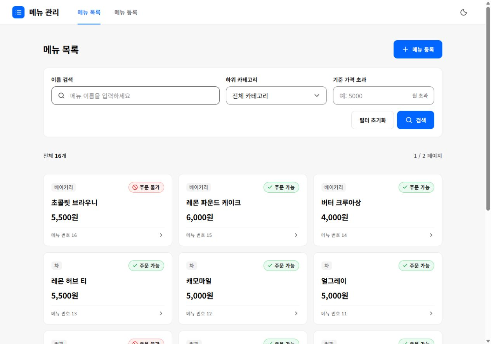

# 메뉴 관리 · 바이브 디자인 & 바이브 코딩 과제

Spring Boot REST API와 React를 연결한 메뉴 관리 앱입니다.
사용자가 전달한 **Claude 디자인**을 공통 헤더·카드·상세·등록/수정 폼에 적용하고 실제 CRUD 검증을 마쳤습니다.
제출 마감: 2026-10-13(화) 23:59. 제출물: Spring Boot와 React 코드가 함께 있는 GitHub 저장소 URL.

제출용 저장소: [kodonghui/vibe-menu-assignment](https://github.com/kodonghui/vibe-menu-assignment).
제출할 때 강사가 저장소에 접근할 수 있도록 공개 설정 또는 초대 권한을 확인하세요.

## 앱과 디자인

- 메뉴 목록·검색·필터·페이징, 상세 조회, 등록·수정·삭제를 실제 서버와 연결합니다.
- 공통 Montage 토큰과 CSS Module을 사용하며 라이트/다크 테마와 모바일 레이아웃을 제공합니다.
- 입력 오류, 로딩, 빈 결과, 404, 통신 실패와 재시도, 삭제 확인을 처리합니다.
- 디자인 원본: [Claude 아티팩트](https://claude.ai/artifact/8ENM2HMyuBCMpbKrF8b1J3) / [인계 원본](design-handoff/claude-result/README.md).
- 실제 구현·검사·게시 상태는 [검증 기록](docs/verification.md)을 기준으로 확인합니다.

## 처음 공부할 때

처음 공부할 때는 [학습 백과사전](docs/encyclopedia.html)을 브라우저에서 여세요.
컴퓨터 밖에서도 읽을 수 있는 [Sites 백과사전](https://menu-app-fullstack-encyclopedia.elddlwkd.chatgpt.site)도 등록했습니다. 기본 접근은 본인 계정 전용입니다.
15개 장·94개 용어·15개 도해를 실제 과제 코드와 연결했습니다.
첫 화면의 **세 질문부터 읽기 → 등록 흐름 따라가기 → 02 메뉴 하나의 여행** 순서로 시작하세요.
단계별 등록 예시는 학습용이며 API 요청이나 DB 변경을 하지 않습니다.
클릭 가능한 코드·공식 자료 출처는 [Markdown 원고](docs/encyclopedia.md)에 있습니다.

[Claude Design 전달 안내](design-handoff/README.md)에는 처음 사용한 프롬프트와 네 첨부 파일, 수신한 시안이 보존되어 있습니다.

## 구성

~~~
08_vibe-menu-assignment/
  backend/             강의 chap06 기반 JPA REST 서버 + Swagger
  frontend/            Vite + React JS/JSX, API 계층과 Claude 디자인 화면
  api-docs.json        실제 실행 서버에서 추출한 OpenAPI
  design-handoff/      Claude Design 프롬프트·화면 범위·토큰·명세 사본
  docs/                API 계약·출처·실제 검사 결과
  scripts/             API 검사·명세 추출·토큰 검사
~~~

[과제 현황판](https://app.notion.com/p/3ebbf16cc3ec817f9f9cc0456adf2b18) /
[현재 작업 기록](https://app.notion.com/p/3ebbf16cc3ec81f3bd96f0656b028432)

## 백과사전 읽기와 보충

HTML 파일 하나로 오프라인에서 읽을 수 있습니다. 검색·목차·용어 카드·등록 흐름 6단계·테마 전환을 제공합니다.
내용 원본은 학습 저장소의 `private-notes/data/vibe-menu-encyclopedia.jsonl`이며 HTML과 Markdown은 생성 결과입니다.
다른 학습 노트나 전체 학습 색인을 다시 만들지 않고 이 과제 자료만 갱신합니다.

`scripts/build-encyclopedia.py`는 부모 학습 저장소의 JSONL·`scripts/study_note.py`·`scripts/lib/diagram.py`를 사용합니다.
이 과제만 복제한 저장소에서는 생성 결과인 HTML/Markdown을 읽으세요. 앱 실행에는 이 생성 과정이 필요하지 않습니다.

현재 열람 주소는 http://localhost:5190/encyclopedia.html 입니다.
열람 서버가 꺼졌으면 HTML 파일을 직접 열거나 아래 명령으로 다시 실행합니다.
이미 5190에서 실행 중이면 두 번째 서버를 띄우지 않습니다.

~~~powershell
python -m http.server 5190 --bind 127.0.0.1 --directory docs
~~~

[학습 자료 작업 기록](https://app.notion.com/p/3ebbf16cc3ec811594e1e629fbee05d1)과
[검증 결과](docs/verification.md)를 함께 확인할 수 있습니다.

## 로컬 Windows 실행

아래 명령의 시작 위치는 이 README가 있는 폴더입니다. 각 터미널에서 같은 과제 폴더를 먼저 여세요.

새 위치에서 처음 받을 때:
~~~powershell
git clone https://github.com/kodonghui/vibe-menu-assignment.git
Set-Location vibe-menu-assignment
~~~

필요한 환경: Java 17, Node.js 20.19+ 또는 22.12+. Gradle은 포함된 wrapper를 사용합니다.
현재 검사 환경의 정확한 버전은 docs/verification.md에 기록합니다.
React 생성은 공식 Vite 템플릿의 react + eslint 옵션을 사용했습니다.
[Vite 공식 시작 안내](https://vite.dev/guide/).

터미널 1 — 서버:
~~~powershell
Set-Location backend
.\gradlew.bat bootRun --console=plain
~~~

터미널 2 — React:
~~~powershell
Set-Location frontend
npm.cmd ci
npm.cmd run dev
~~~

- 앱: http://localhost:5175
- Swagger: http://localhost:8090/swagger-ui.html
- 서버 상태: http://localhost:8090/actuator/health
- API 명세: http://localhost:8090/v3/api-docs

기존 8080 서버와 충돌하지 않게 8090/5175를 사용합니다.
React는 strictPort로 고정되어 포트가 사용 중이면 오류를 알립니다. 기존 앱을 임의 종료하지 않습니다.
이미 실행 중이면 위 명령으로 두 번째 서버를 띄우지 말고 현재 주소를 사용하세요.
종료는 실행한 터미널에서 Ctrl+C입니다.

## 데이터와 MySQL

기본 dev 프로필은 backend/.runtime/data/vibe-menu.mv.db에 H2 파일 DB를 만듭니다.
강의의 기존 MySQL menudb는 사용하지 않습니다.
처음 빈 과제 DB를 만들 때만 8개 카테고리와 16개 예시 메뉴가 생성됩니다.
재실행해도 사용자가 등록·수정한 데이터가 유지되고, 비워진 메뉴를 자동 복원하지 않습니다.
이 데이터는 과제 데모용입니다.

MySQL로 실행하려면 관리자 권한으로 과제 전용 DB를 준비합니다:
~~~sql
CREATE DATABASE IF NOT EXISTS vibe_menu_assignment CHARACTER SET utf8mb4;
~~~
해당 DB에만 권한이 있는 자신의 로컬 계정을 사용하고, 터미널 환경변수로 연결합니다:
~~~powershell
$env:DB_USERNAME = '<과제 DB 계정>'
$env:DB_PASSWORD = '<로컬 비밀번호>'
.\gradlew.bat bootRun --args='--spring.profiles.active=mysql' --console=plain
~~~
비밀번호를 파일·Git·스크린샷에 남기지 않습니다. 필요하면 DB_URL도 환경변수로 설정합니다.
현재 실제 CRUD 검증은 H2 프로필로 수행했습니다. MySQL 프로필은 연결 설정을 제공하며 실제 연결 검증은 별도입니다.

## 기능과 디자인 적용 지점

- 목록·서버 페이징·이름 검색·카테고리·가격 초과 필터.
- 상세·등록·수정·삭제 확인/취소·저장 후 이동.
- 입력 검증·로딩·빈 결과·서버 오류·재시도.
- 검색 조건은 URL에 저장되어 새로고침/뒤로가기에 유지됩니다.
- 요청은 src/api/*.js에, 화면은 src/pages에, 공통 조각은 src/components에 있습니다.
- 공통 스타일은 src/components/MenuUi.module.css, 테마·레이아웃은 Layout.jsx에 있습니다.
- 시안의 템플릿 문법은 React로 옮겼으며 Claude 캔버스 런타임이나 보드 전용 스타일을 앱에서 실행하지 않습니다.
- 토큰 원본은 frontend/design/montage.tokens.json입니다. tokens.css를 직접 고치지 않습니다.
- [API 계약](docs/api-contract.md)에서 응답 키·가격 초과 조건·페이지 1 시작·삭제 상태를 확인하세요.

## 검사와 명세 갱신

~~~powershell
Set-Location backend
.\gradlew.bat test bootJar --console=plain

Set-Location '..\frontend'
npm.cmd run lint
npm.cmd run build

Set-Location '..'
node scripts/check-tokens.mjs
node scripts/verify-api.mjs
node scripts/export-api.mjs
~~~

API 검사·명세 추출은 서버가 실행 중일 때 사용합니다.
API 검사는 자신이 만든 검사 메뉴만 정리하며 기존 예시 메뉴를 변경하지 않습니다.
[검증 결과](docs/verification.md)는 실제 실행 범위와 아직 남은 일을 구분합니다.

## 출처와 제출

[출처 기록](docs/sources.md)에 재사용한 강의 서버·API 어댑터·토큰과 새 구현을 구분합니다.
백엔드와 디자인 토큰은 강의가 허용한 자료를 재사용하며, 참고 완성본의 화면 디자인을 그대로 복제하지 않았습니다.
디자인은 사용자가 전달한 Claude Design 결과를 기준으로 합니다. 실제 데이터·집계는 메뉴 API 응답을 사용합니다.

과제 앱의 backend·frontend는 학습 저장소의 일반 폴더로 관리합니다.
학습 백과사전 Sites와 디자인 Sites 초안은 별도 관리되며 제출용 Git에서 제외합니다.
학습 저장소의 이 폴더만 subtree로 분리해 backend·frontend·실행 안내를 함께 제출합니다.
DB 파일·실제 환경변수·node_modules·빌드 결과·학습 저장소의 다른 폴더는 포함하지 않습니다.
배포 URL은 공지의 명시된 제출 항목이 아닙니다. GitHub URL을 개인별 Discord 제출 스레드에 남겨야 실제 제출이 끝납니다.
