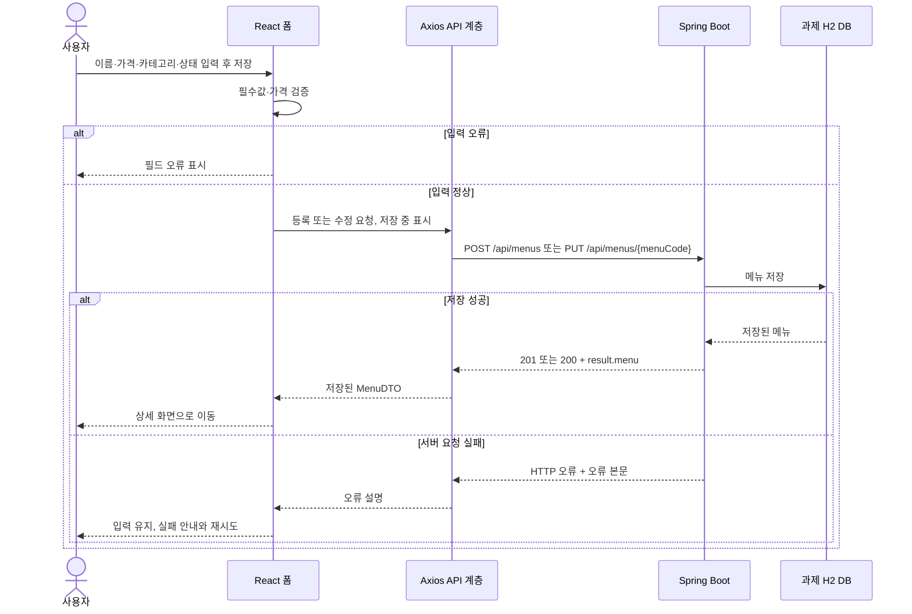

# 메뉴 관리 API 계약

기준: 과제 backend의 컨트롤러와 실행 서버에서 추출한 ../api-docs.json.
2026-09-30 사용자 요청에 따라 chap06 강의 API 계약을 재사용한다.

## 메뉴 저장 흐름

현재 구현의 등록·수정 흐름이다. 디자인 적용 후에도 같은 API 계약을 사용한다.

## 연결과 응답

- 서버: http://localhost:8090. React: http://localhost:5175.
- 인증: 이번 과제에는 로그인·토큰 인증이 없다. CORS 허용은 인증이 아니다.
- 정상 응답: { "httpStatus": 200, "message": "...", "result": { ... } }.
- 오류 응답: { "code": "...", "description": "...", "detail": "..." }.
- Axios의 실제 HTTP 상태가 성공/실패 판단 기준이다. api/에서 result를 꺼내 화면에 전달한다.
- menuCode와 categoryCode로 URL을 조립한다. PokeAPI의 응답 URL 추종 규칙을 이 서버에 적용하지 않는다.

## 메서드와 결과 키

| 요청 | 입력 | result 내부 | 실제 HTTP |
|---|---|---|---|
| GET /api/menus | 없음 | menus: MenuDTO[] | 200 |
| GET /api/menus/pages | page(1부터), size | content, totalElements, totalPages, size, number(1부터), first, last | 200 |
| GET /api/menus/pages/sort | page, size, sortBy, direction | 위 페이지 응답 + sort, direction | 200 |
| GET /api/menus/{menuCode} | 메뉴 코드 | menu: MenuDTO | 200 / 없는 메뉴 404 |
| GET /api/menus/search | menuPrice | menus, searchPrice | 200 |
| POST /api/menus | 등록 본문 | menu: MenuDTO | 201 / 잘못된 카테고리 400 |
| PUT /api/menus/{menuCode} | 메뉴 코드, 등록과 같은 전체 본문 | menu: MenuDTO | 200 / 없는 메뉴 404 |
| DELETE /api/menus/{menuCode} | 메뉴 코드 | deletedMenuCode | 200 / 없는 메뉴 404 |
| GET /api/categories | 없음 | categories: CategoryDTO[] | 200 |
| GET /api/categories/{categoryCode} | 카테고리 코드 | category: CategoryDTO | 200 / 없는 카테고리 404 |

가격 검색은 기준값 **초과(>)**이다. 이름 검색과 카테고리 필터 API는 없으므로 전체 목록을 받아 React에서 필터링·페이징한다.
페이지 요청·응답의 번호는 모두 1부터다. size 최대 100이다.
삭제의 실제 HTTP는 200이고 본문 httpStatus는 204다. 원래 강의 계약을 유지한다.
정렬 API는 참고용으로 보존하며 현재 기본 화면은 목록의 서버 페이징을 사용한다.

## DTO

MenuDTO: menuCode(정수), menuName(문자열), menuPrice(정수), categoryCode(정수),
categoryName(문자열), orderableStatus('Y' 또는 'N').

CategoryDTO: categoryCode(정수), categoryName(문자열),
refCategoryCode(정수 또는 null), refCategoryName(문자열 또는 null).
상위 분류의 ref 값은 null이고, 메뉴 등록 화면에서는 하위 분류를 선택한다.

등록 본문 예:
~~~json
{
  "menuName": "아메리카노",
  "menuPrice": 4500,
  "categoryCode": 6,
  "orderableStatus": "Y"
}
~~~
카테고리 코드는 GET /api/categories에서 실제 조회한 하위 코드를 사용한다.
등록 때 menuCode·categoryName을 보내지 않는다.
React는 이름 필수/100자 이내, 가격 0 이상 int 범위 정수, 하위 카테고리 필수를 검증한다.
서버의 별도 검증·실패는 실제 HTTP와 오류 응답을 따른다.

오류 코드: ERROR_CODE_00001 메뉴 없음 / ERROR_CODE_00002 카테고리 없음 /
ERROR_CODE_00003 잘못된 요청 값 / ERROR_CODE_99999 내부 오류.

## 완료 확인

scripts/verify-api.mjs에서 실제 서버에 조회→등록→수정→삭제를 요청하고,
가격 경계·페이지·오류·CORS·OpenAPI를 확인한다. 생성한 검사 메뉴는 finally에서 정리한다.
