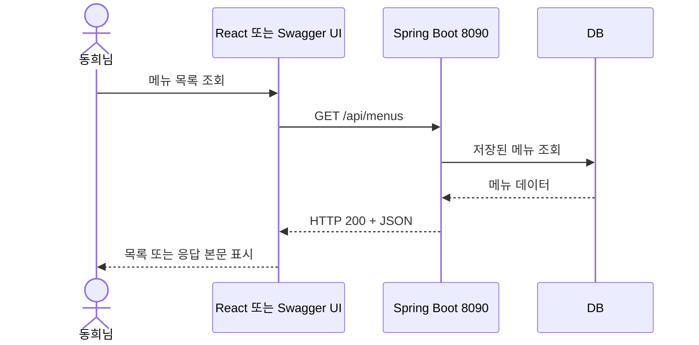
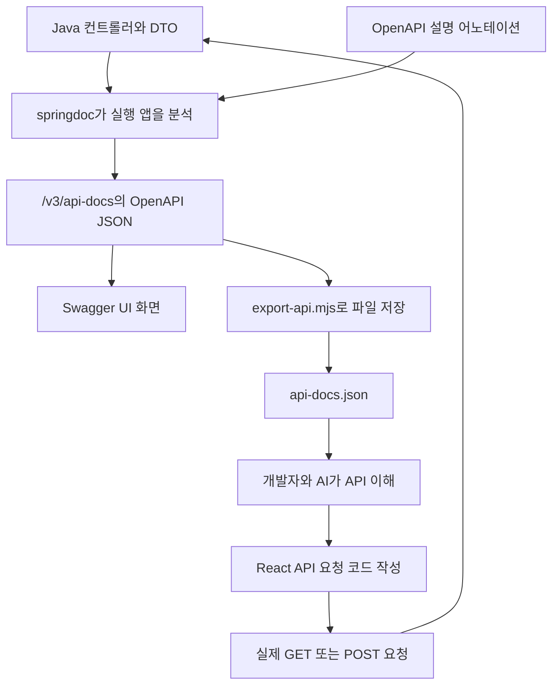
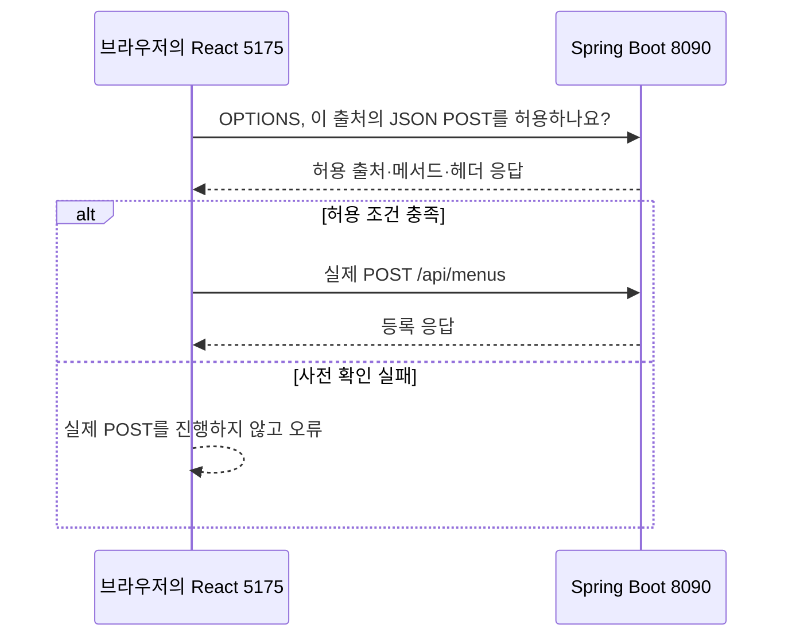

# HTTP·API·OpenAPI·Swagger 백과사전

기준: 2026-09-30에 읽은 과제 소스와 저장된 API 명세. 이 문서는 설명 자료이며 서버·React·DB 설정을 변경하지 않습니다. 예시의 메뉴 코드·등록 결과·전체 개수는 실행 시점에 달라질 수 있습니다.

## 동희님 질문에 먼저 답하면

**`servers`, `tags`, `paths`는 OpenAPI가 정한 문서 항목 이름입니다.** 그 안에 넣는 서버 주소, 메뉴 API 주소, 설명은 우리 프로그램에 맞게 정합니다. `tags`라는 이름은 정해져 있지만 태그 값인 `메뉴`는 우리 프로젝트에서 붙인 이름입니다. OpenAPI 명세가 이 구조를 정의합니다. [OpenAPI 3.1.0 표준](https://spec.openapis.org/oas/v3.1.0.html)

**현재 과제의 Java 서버는 `api-docs.json`을 읽어 메뉴 기능을 실행하지 않습니다.** 순서는 Java 코드·어노테이션 → springdoc의 문서 생성 → `/v3/api-docs` → Swagger UI·저장된 JSON입니다. React도 이 JSON 파일을 불러 메뉴를 저장하지 않습니다. React의 `src/api/menu.js`가 HTTP 요청을 보냅니다.

**Swagger UI는 API 설명을 보면서 실제 요청을 보내는 개발자용 화면입니다.** 제가 그 화면 자체를 새로 개발한 것은 아닙니다. 참고 샘플에 있던 springdoc·Swagger 설정과 설명 어노테이션을 재사용하고, 과제 주소에 맞춰 설정하고, 실행 서버에서 명세를 추출했습니다. Swagger UI의 기능은 공식 도구가 제공합니다. [Swagger UI 공식 설명](https://swagger.io/open-source/swagger-ui/)

“실무에서 가장 많이 쓰나요?”에는 전 세계·한국·Java 회사 전체의 1위를 확인할 비교 자료가 없습니다. 이 문서에서는 사용량 순위를 단정하지 않습니다. 개발자에게 API를 설명하고 직접 호출하게 하는 도구로 공식 제공되며, Spring Boot 프로젝트에서는 springdoc으로 연결할 수 있습니다. [springdoc 공식 안내](https://springdoc.org/)

## 1. API는 무엇을 정하는 약속인가

API는 프로그램이 다른 프로그램의 기능을 사용할 수 있도록 공개한 접점입니다. 이번 과제에서는 브라우저에서 실행하는 React가 메뉴 서버의 기능을 사용합니다. 사람이 자바 메서드 이름을 화면에 입력하는 대신, React가 약속한 HTTP 메서드와 주소로 요청을 보냅니다.

이번에 알아야 할 API는 다음입니다.

```text
GET http://localhost:8090/api/menus
```

`GET`은 요청의 방식이고, 뒤의 URL은 요청할 대상입니다. 이 조합이 메뉴 목록 조회를 뜻합니다. 서버는 자신의 Java 코드로 메뉴를 조회한 후 JSON 응답을 돌려줍니다. React가 Java 파일을 다운로드해서 실행하는 구조가 아닙니다.

API 계약은 요청 주소만 적은 목록보다 넓습니다. 어떤 메서드를 쓸지, 입력 이름과 타입은 무엇인지, 어떤 응답 키가 돌아올지, 실패하면 무엇을 보여줄지까지 약속해야 서로 연결할 수 있습니다. 우리의 계약은 [api-contract.md](C:/Study-saltlux-ai-agent-service/90_Project/08_vibe-menu-assignment/docs/api-contract.md)에 있습니다.

예를 들어 서버가 메뉴 배열을 `result.menus`에 담는데 React가 `result.items`를 읽으면 화면을 제대로 채울 수 없습니다. 둘 다 “목록을 조회했다”는 생각만 공유해서는 부족합니다. **정확한 이름과 구조가 맞아야 합니다.**

## 2. HTTP는 요청과 응답을 주고받는 규칙입니다

HTTP는 브라우저와 서버가 요청·응답을 교환하는 프로토콜입니다. 프로토콜은 서로 이해할 메시지 규칙입니다. 클라이언트가 요청하고 서버가 응답하는 구조를 사용합니다. 이 과제에서는 React와 Swagger UI가 둘 다 API 클라이언트가 될 수 있습니다. [MDN HTTP 개요](https://developer.mozilla.org/en-US/docs/Web/HTTP/Guides/Overview)



같은 API를 요청해도 보여주는 방법은 다릅니다. React는 이름·가격·버튼이 있는 서비스 화면을 만들고, Swagger UI는 개발자가 확인하기 좋게 원본 응답과 상태를 보여줍니다. Swagger UI가 React의 UI 디자인을 만들어주지는 않습니다.

## 3. URL·localhost·포트·경로·쿼리를 읽는 법

다음 주소를 나누어 보겠습니다.

```text
http://localhost:8090/api/menus/pages?page=1&size=12
```

| 부분 | 뜻 | 우리 과제의 실제 값 |
|---|---|---|
| `http` | 통신 방식 | 개발용 HTTP |
| `localhost` | 요청을 보내는 환경의 자기 컴퓨터 | 지금 서버가 켜진 동희님 PC |
| `8090` | 같은 컴퓨터에서 찾아갈 포트 | Spring Boot 서버의 포트 |
| `/api/menus/pages` | 서버 안의 요청 경로 | 메뉴 페이지 조회 |
| `?page=1&size=12` | 조회 조건을 붙인 쿼리 문자열 | 첫 페이지, 최대 12개 |

이 주소에서 `pages`는 파일 확장자가 아닙니다. 서버가 약속한 경로 이름입니다. 포트는 프로그램을 찾아가는 연결 번호입니다. React 개발 화면을 제공하는 Vite는 `5175`, 메뉴 API 서버는 `8090`을 사용합니다. 값은 [application.yaml](C:/Study-saltlux-ai-agent-service/90_Project/08_vibe-menu-assignment/backend/src/main/resources/application.yaml:16)과 [client.js](C:/Study-saltlux-ai-agent-service/90_Project/08_vibe-menu-assignment/frontend/src/api/client.js:3)에 있습니다.

`localhost`는 인터넷에 게시된 고정 주소가 아닙니다. 친구의 컴퓨터에서 `localhost:8090`을 열면 친구 컴퓨터의 8090번을 찾습니다. GitHub에 코드를 올려도 이 주소로 우리 서버가 자동 공개되지는 않습니다.

**경로 변수와 쿼리 파라미터도 구분합니다.**

```text
/api/menus/1                  → 메뉴 코드 1 한 건
/api/menus/search?menuPrice=5000 → 5,000원보다 비싼 메뉴들
```

명세의 `/api/menus/{menuCode}`에서 중괄호는 값을 넣을 자리라는 뜻입니다. 실제 요청에서는 `{menuCode}`를 `1` 같은 코드로 바꿉니다. Java에서는 `@PathVariable`이 경로의 값을 받고, `@RequestParam`이 쿼리의 값을 받습니다. 이는 Spring MVC의 요청 매핑 규칙입니다. [Spring 요청 매핑 공식 문서](https://docs.spring.io/spring-framework/reference/web/webmvc/mvc-controller/ann-requestmapping.html)

## 4. 메서드는 같은 주소에서 무엇을 할지 구분합니다

| 메서드 | 일반적 의미 | 이 과제에서 사용 |
|---|---|---|
| GET | 조회 | 목록·상세·가격 검색 |
| POST | 새 데이터 처리·생성 | 메뉴 등록 |
| PUT | 지정한 대상의 정보 교체·수정 | 메뉴 전체 입력값 수정 |
| DELETE | 대상 삭제 | 메뉴 삭제 |
| OPTIONS | 통신 옵션 확인 | 브라우저의 CORS 사전 확인 |

HTTP 메서드에는 안전성·멱등성 같은 의미도 있습니다. 여기서는 먼저 조회와 변경을 구분하시면 됩니다. GET은 데이터 변경을 의도하지 않는 조회 방식입니다. POST·PUT·DELETE는 이 과제에서 DB를 변경합니다. 같은 `/api/menus`라도 GET은 목록 조회이고 POST는 등록입니다. [MDN HTTP 메서드](https://developer.mozilla.org/en-US/docs/Web/HTTP/Reference/Methods)

브라우저 주소창에 URL을 입력해 여는 것은 보통 GET 요청입니다. 주소창에 `/api/menus`를 열었다고 새 메뉴가 등록되지 않습니다. 등록은 POST와 등록 정보를 함께 보내야 합니다.

## 5. 헤더·본문·JSON은 서로 다른 층입니다

요청에는 메서드·대상 주소 외에 헤더와 필요할 경우 본문이 있습니다. 헤더는 메시지의 형식 같은 부가 정보를 전달하고, 본문은 실제 전달 내용입니다. 다음은 등록 요청을 학습용 HTTP/1.1 텍스트로 표시한 것입니다. 실제 브라우저 화면에는 다른 헤더가 더 보일 수 있습니다. [MDN HTTP 메시지](https://developer.mozilla.org/en-US/docs/Web/HTTP/Guides/Messages)

```http
POST /api/menus HTTP/1.1
Host: localhost:8090
Content-Type: application/json

{
  "menuName": "학습용 라떼",
  "menuPrice": 5000,
  "categoryCode": 6,
  "orderableStatus": "Y"
}
```

`Content-Type: application/json`은 본문 형식을 설명합니다. `categoryCode: 6`은 학습용 예시이며 실제 존재하는 하위 카테고리 코드는 카테고리 조회에서 확인합니다. 이 예제를 읽기만 해도 됩니다. 요청을 실행하면 실제 등록이 일어납니다.

JSON은 데이터를 적는 텍스트 형식입니다. 객체는 `{}`, 배열은 `[]`, 문자열은 큰따옴표, 숫자는 따옴표 없는 값으로 적습니다. `null`은 값이 없음을 표현하는 별도 값입니다. JSON은 Java·JavaScript 코드 자체가 아닙니다. 여러 언어가 이 형식으로 데이터를 주고받을 수 있습니다. [MDN JSON](https://developer.mozilla.org/en-US/docs/Web/JavaScript/Reference/Global_Objects/JSON)

`5000`과 `"5000"`은 형식상 다릅니다. 앞은 숫자, 뒤는 문자열입니다. 이 과제의 가격 계약은 정수입니다. `orderableStatus`는 `"Y"` 또는 `"N"` 문자열이며 불리언 `true`·`false`로 보내는 계약이 아닙니다.

## 6. 응답에서 상태와 데이터를 따로 읽습니다

목록 요청의 정상 응답은 다음 모양입니다. 메뉴 값·개수는 예시입니다.

```json
{
  "httpStatus": 200,
  "message": "메뉴 목록 조회 성공",
  "result": {
    "menus": [
      {
        "menuCode": 1,
        "menuName": "아메리카노",
        "menuPrice": 4500,
        "categoryCode": 6,
        "categoryName": "커피",
        "orderableStatus": "Y"
      }
    ]
  }
}
```

바깥의 JSON 객체 안에 `result`, 그 안에 `menus` 배열, 그 배열 안에 메뉴 객체가 있습니다. `menus`와 상세 조회의 `menu`를 혼동하지 않습니다. 실제 조립 코드는 [MenuController.java](C:/Study-saltlux-ai-agent-service/90_Project/08_vibe-menu-assignment/backend/src/main/java/com/ohgiraffers/springdatajpa/controller/MenuController.java:59)에 있습니다.

**실제 HTTP 상태와 JSON의 `httpStatus`는 별개입니다.** HTTP 상태는 통신 응답의 메타데이터이고, JSON 키는 서버 개발자가 본문에 만든 항목입니다. 대부분 같은 숫자지만 이 강의 서버의 삭제는 서로 다릅니다.

| 실제 HTTP 상태 | 우리 과제에서의 뜻 |
|---|---|
| 200 | 조회·수정·삭제 성공 |
| 201 | 메뉴 생성 성공 |
| 400 | 잘못된 입력·잘못된 카테고리 등 |
| 404 | 해당 메뉴·카테고리가 없음 |
| 500 | 서버 내부 오류 |

삭제 메서드는 본문 `httpStatus`에 `204`를 넣지만 `.status(HttpStatus.OK)`로 실제 HTTP `200`을 보냅니다. 이 과제는 강의 계약을 유지하고 있습니다. 실제 HTTP `204 No Content`는 본문 없는 응답입니다. “200+본문 내부204”와 “실제204”를 같은 것으로 읽지 않습니다. [삭제 메서드](C:/Study-saltlux-ai-agent-service/90_Project/08_vibe-menu-assignment/backend/src/main/java/com/ohgiraffers/springdatajpa/controller/MenuController.java:389), [MDN 204](https://developer.mozilla.org/en-US/docs/Web/HTTP/Reference/Status/204)

오류 본문은 정상의 `result` 포장과 다릅니다. `code`, `description`, `detail`을 확인합니다. HTTP 요청이 아예 연결되지 않으면 서버 오류 JSON조차 없을 수 있습니다. React의 [toMessage](C:/Study-saltlux-ai-agent-service/90_Project/08_vibe-menu-assignment/frontend/src/api/client.js:19)는 서버가 준 오류 설명과 연결 실패를 구분합니다.

## 7. 이번 과제의 API 10개

다음은 현재 컨트롤러와 저장된 명세에 있는 10개의 HTTP 작업입니다. 경로 수는 7개지만 같은 경로의 GET·POST·PUT·DELETE를 따로 세어 10개입니다. API 개수라는 말은 어떤 기준으로 세었는지 함께 봅니다.

| 요청 | 입력 위치 | 성공 데이터 | 실제 성공 상태 |
|---|---|---|---|
| GET `/api/menus` | 없음 | `result.menus` | 200 |
| GET `/api/menus/pages` | 쿼리 `page`, `size` | `result.content`와 페이지 정보 | 200 |
| GET `/api/menus/pages/sort` | 쿼리 `page`, `size`, `sortBy`, `direction` | 페이지 정보와 정렬 정보 | 200 |
| GET `/api/menus/{menuCode}` | 경로 메뉴 코드 | `result.menu` | 200 |
| GET `/api/menus/search` | 쿼리 `menuPrice` | `result.menus`, `searchPrice` | 200 |
| POST `/api/menus` | JSON 본문 | `result.menu` | 201 |
| PUT `/api/menus/{menuCode}` | 경로 코드와 JSON 본문 | `result.menu` | 200 |
| DELETE `/api/menus/{menuCode}` | 경로 코드 | `result.deletedMenuCode` | 200 |
| GET `/api/categories` | 없음 | `result.categories` | 200 |
| GET `/api/categories/{categoryCode}` | 경로 카테고리 코드 | `result.category` | 200 |

계약 출처: [MenuController.java](C:/Study-saltlux-ai-agent-service/90_Project/08_vibe-menu-assignment/backend/src/main/java/com/ohgiraffers/springdatajpa/controller/MenuController.java:37), [CategoryController.java](C:/Study-saltlux-ai-agent-service/90_Project/08_vibe-menu-assignment/backend/src/main/java/com/ohgiraffers/springdatajpa/controller/CategoryController.java:21), [api-docs.json](C:/Study-saltlux-ai-agent-service/90_Project/08_vibe-menu-assignment/api-docs.json:28).

가격 검색은 **기준값 초과**입니다. `menuPrice=5000`이면 5,000원 메뉴는 포함되지 않습니다. 페이지 요청은 **1부터**이며 응답 `number`도 1부터입니다. 내부 Spring `Page` 번호는 0부터여서 컨트롤러가 반환할 때 `+1`을 합니다. `size`의 최대치는 100입니다. [페이지 반환 코드](C:/Study-saltlux-ai-agent-service/90_Project/08_vibe-menu-assignment/backend/src/main/java/com/ohgiraffers/springdatajpa/controller/MenuController.java:106), [페이지 설정](C:/Study-saltlux-ai-agent-service/90_Project/08_vibe-menu-assignment/backend/src/main/resources/application.yaml:9)

이름 검색과 카테고리 필터 전용 서버 API는 없습니다. 현재 React는 전체 메뉴를 받아 이 조건을 화면 쪽에서 적용합니다. API 명세에 없는 사진·평점·재고·매출·로그인을 디자인에 그려 넣으면 기능까지 저절로 생기는 것이 아닙니다. 별도 설계·구현이 필요합니다.

## 8. OpenAPI 문서의 항목은 누가 정했나요

OpenAPI는 HTTP API를 설명하는 표준입니다. 표준은 문서 항목의 의미와 문법을 정하고, 프로젝트는 그 항목의 값을 채웁니다. 우리의 파일은 첫 부분에 `"openapi": "3.1.0"`이 있습니다. 이는 **이 파일이 따르는 명세 형식 버전**입니다. `info.version: "v1"`은 **우리 API의 문서상 버전**입니다. 서로 다른 버전이며 Java·Spring Boot·H2의 버전도 아닙니다. [실제 명세 시작](C:/Study-saltlux-ai-agent-service/90_Project/08_vibe-menu-assignment/api-docs.json:1), [Swagger의 API 버전 설명](https://swagger.io/docs/specification/v3_0/api-general-info/)

| 표준 항목 | 설명 | 현재 파일의 예 |
|---|---|---|
| `openapi` | 문서가 따르는 표준 버전 | `3.1.0` |
| `info` | 제목·설명·API 버전 | 메뉴 관리 API 명세서, `v1` |
| `servers` | 요청 대상 서버 주소 목록 | `http://localhost:8090` |
| `tags` | API를 묶는 이름·설명 | 메뉴, 카테고리 |
| `paths` | 경로별 작업 | `/api/menus` 아래 `get`, `post` |
| `parameters` | 경로·쿼리 등의 입력 설명 | `menuCode`, `in: path` |
| `requestBody` | 요청 본문 형식 | JSON 메뉴 정보 |
| `responses` | 상태별 응답 설명 | `201` 등록 성공 |
| `components.schemas` | 재사용하는 데이터 모양 | `MenuDTO`, `ResponseMessage` |
| `$ref` | 다른 정의를 참조 | `#/components/schemas/MenuDTO` |

항목 이름·의미의 근거: [OpenAPI 3.1.0 문서 구조](https://spec.openapis.org/oas/v3.1.0.html). 이 표에 있는 항목을 모두 항상 필수로 적어야 한다는 뜻은 아닙니다. 표준에는 필수와 선택 항목이 구분되어 있습니다.

다음은 **학습용으로 줄인 명세 일부**입니다. 전체 문서 복사본이 아닙니다.

```json
{
  "servers": [{ "url": "http://localhost:8090" }],
  "paths": {
    "/api/menus": {
      "get": {
        "tags": ["메뉴"],
        "summary": "전체 메뉴 조회",
        "responses": {
          "200": { "description": "조회 성공" }
        }
      }
    }
  }
}
```

`servers`를 `myServers`로 마음대로 바꾸면 OpenAPI 도구는 그것을 표준 서버 목록으로 읽지 않습니다. `url`의 값과 `/api/menus`의 값은 서버 구현에 맞게 정할 수 있습니다. 경로의 `get` 역시 문서에서 사용하는 HTTP 작업 키입니다. [Swagger의 경로·작업 설명](https://swagger.io/docs/specification/v3_0/paths-and-operations/)

`메뉴` 태그는 문서의 분류이며 DB 테이블이나 요청 주소를 자동 생성하지 않습니다. [Swagger의 태그 설명](https://swagger.io/docs/specification/v3_0/grouping-operations-with-tags/)

`$ref`는 “이 문서의 이 정의를 참고하세요”라는 참조입니다. `#/components/schemas/MenuDTO`는 서버에 새 HTTP 요청을 보내라는 뜻이 아닙니다. `menuCode`·`menuPrice` 등의 타입을 정의한 스키마 위치를 가리킵니다. [Swagger의 참조 설명](https://swagger.io/docs/specification/v3_0/using-ref/)

## 9. Java가 명세를 읽는 게 아니라, 지금은 Java에서 명세가 나옵니다

현재 구현은 코드에서 명세를 만드는 방식입니다. 흔히 **code-first**라고 부릅니다.



springdoc는 실행 중인 앱의 설정·클래스·어노테이션을 분석해 API 문서를 생성하는 Java 라이브러리입니다. 우리의 [build.gradle](C:/Study-saltlux-ai-agent-service/90_Project/08_vibe-menu-assignment/backend/build.gradle:45)에 `springdoc-openapi-starter-webmvc-ui:3.1.0`이 있습니다. `3.1.0`이라는 숫자가 OpenAPI 버전과 같아 보이지만 여기서는 **라이브러리 버전**입니다. [springdoc의 생성 방식](https://springdoc.org/)

어노테이션도 두 역할을 나눠 읽습니다.

| Java 어노테이션 | 이번 코드에서의 역할 |
|---|---|
| `@RequestMapping`, `@GetMapping`, `@PostMapping` | 실제 요청을 어떤 메서드가 받을지 지정 |
| `@PathVariable`, `@RequestParam`, `@RequestBody` | 요청의 값을 Java 매개변수에 전달 |
| `@Tag`, `@Operation`, `@ApiResponse` | 명세에 이름·설명·응답 설명을 제공 |
| `@OpenAPIDefinition`, `@Info` | 명세 제목·설명·문서 버전 제공 |

예를 들어 실제 코드의 `@RequestMapping("/api/menus")`와 `@GetMapping`이 목록 요청을 `findAllMenus()`에 연결합니다. `@Operation(summary = "전체 메뉴 조회")`는 Swagger UI의 설명을 더합니다. 제목을 바꾸는 것과 실제 요청 경로를 바꾸는 것은 다른 변경입니다.

```java
// 실제 클래스에서 학습에 필요한 선언 부분만 발췌했습니다.
@Tag(name = "메뉴", description = "메뉴 조회와 등록·수정·삭제를 제공한다.")
@RestController
@RequestMapping("/api/menus")
public class MenuController {
    // 필드·생성자·각 메서드 구현은 원본 파일에 있습니다.
}
```

원본: [MenuController.java](C:/Study-saltlux-ai-agent-service/90_Project/08_vibe-menu-assignment/backend/src/main/java/com/ohgiraffers/springdatajpa/controller/MenuController.java:37). 실행할 전체 코드는 위 조각이 아니라 링크의 실제 파일입니다.

명세 저장은 [export-api.mjs](C:/Study-saltlux-ai-agent-service/90_Project/08_vibe-menu-assignment/scripts/export-api.mjs:5)가 `/v3/api-docs`에 GET 요청을 보내 JSON을 파일로 적는 작업입니다. 서버에서 내려주는 문서와 저장 파일은 구분해야 합니다. 코드를 나중에 바꾸면 서버의 문서는 바뀌어도 저장해둔 파일은 다시 추출하기 전까지 과거 문서일 수 있습니다.

React의 [createMenu](C:/Study-saltlux-ai-agent-service/90_Project/08_vibe-menu-assignment/frontend/src/api/menu.js:41)는 JSON 명세를 실행하지 않고 `postResult('/api/menus', {...})`를 호출합니다. [client.js](C:/Study-saltlux-ai-agent-service/90_Project/08_vibe-menu-assignment/frontend/src/api/client.js:10)의 Axios가 실제 서버에 POST 요청을 보냅니다. **명세를 참고해 요청 코드를 만들었지만 실행 시 요청하는 것은 API입니다.**

## 10. 명세부터 코드를 만드는 방식도 있습니다

모든 프로젝트가 지금 과제와 같은 순서를 쓰는 것은 아닙니다. API를 먼저 설계해서 OpenAPI 문서를 정하고 그 문서를 기준으로 구현하는 방식도 있습니다. 흔히 design-first 또는 contract-first라고 부릅니다. Swagger Editor는 명세를 작성·검토하는 도구이고, Swagger Codegen은 명세에서 서버 뼈대나 클라이언트 코드를 생성하는 도구입니다. [Swagger Editor](https://swagger.io/open-source/swagger-editor/), [Swagger Codegen](https://swagger.io/docs/open-source-tools/swagger-codegen/codegen-v3/about/)

```text
현재 과제: Java 구현 → 명세 생성 → 사람이 참고 → React 요청 코드
다른 방식: 명세 설계 → 코드 생성 도구 → 구현을 채움 → 앱 실행
```

코드 생성도 별도 도구를 실행하는 단계입니다. `api-docs.json`을 폴더에 넣는 것만으로 메뉴 저장 로직이 만들어지지는 않습니다. 현재 과제에는 이 코드 생성 절차를 적용하지 않았습니다.

## 11. Swagger UI·OpenAPI·springdoc·Postman의 차이

| 이름 | 무엇인가 | 현재 과제에서 하는 일 |
|---|---|---|
| OpenAPI | 명세를 적는 표준 | 문서 구조의 규칙 |
| `api-docs.json` | 그 표준으로 적은 파일 | 저장한 API 설명서 |
| springdoc-openapi | Spring 앱을 분석하는 라이브러리 | Java에서 명세 생성·UI 연결 |
| Swagger UI | 명세를 읽는 개발자용 웹 화면 | API 확인·직접 요청 |
| Swagger Editor | 명세 작성·검토 도구 | 현재 사용하지 않음 |
| Postman | API 요청·검사 도구 | 현재 과제 실행에 필수 아님 |

Postman은 API 요청을 만들고 테스트하는 기능을 제공하며, Swagger UI는 명세를 기반으로 작업별 설명과 입력을 보여줍니다. 역할이 일부 겹쳐도 같은 프로그램은 아닙니다. [Postman 공식 소개](https://learning.postman.com/docs/getting-started/overview/)

실무에서 Swagger UI를 사용할 수 있는 시점은 다음과 같습니다.

- 백엔드가 새 API를 추가했을 때 어떤 입력·응답인지 공유합니다.
- 프론트엔드 개발자가 화면 구현 전에 호출 방법을 확인합니다.
- 오류가 났을 때 화면을 거치지 않고 API를 직접 호출해 결과를 비교합니다.
- 새 팀원이 API 구조를 익힙니다.

이는 도구 기능을 우리 개발 흐름에 적용한 예이며 모든 회사의 필수 절차나 사용률 통계가 아닙니다. 회사는 접근 가능한 개발 문서, 별도 테스트 클라이언트, 자동화 검사 등을 조합할 수 있습니다. 현재 과제는 Swagger UI와 자체 검사 스크립트를 함께 사용합니다.

Swagger UI의 **Example Value**는 스키마로 만들어진 예시일 수 있습니다. 실제 DB에서 조회한 결과는 실행 후의 **Server response**와 **Response body**에서 확인합니다. 화면에 보이는 예시 숫자를 이미 DB에 저장된 메뉴 코드라고 단정하지 않습니다.

## 12. 자동 생성 문서도 실제 계약을 모두 표현하지는 못합니다

현재 명세에는 두 가지 구체적인 한계가 있습니다.

첫째, 정상 응답의 `result`는 Java의 `Map<String, Object>`라서 생성 스키마에는 자유로운 객체로 나타납니다. `menu`, `menus`, `content` 등 작업마다 다른 내부 키를 스키마만 보고 정확히 알기 어렵습니다. 컨트롤러의 설명과 `api-contract.md`가 이를 보완합니다. [Map 설명 주석](C:/Study-saltlux-ai-agent-service/90_Project/08_vibe-menu-assignment/backend/src/main/java/com/ohgiraffers/springdatajpa/controller/MenuController.java:31), [실제 ResponseMessage 스키마](C:/Study-saltlux-ai-agent-service/90_Project/08_vibe-menu-assignment/api-docs.json:407)

둘째, 저장된 명세의 페이지 파라미터는 `pageable` 객체이고 `Pageable.page.minimum`은 `0`입니다. 실제 과제 계약은 요청·응답 페이지 번호를 1부터 쓰며 설명에는 그 규칙을 적었습니다. 즉 자동 생성된 일반 타입 정보가 실제 웹 설정까지 완벽하게 표현하지는 못했습니다. **이 문서는 명세를 읽는 법을 설명하는 작업이므로 앱을 몰래 변경해서 이 차이를 지우지 않습니다.** [현재 Pageable 스키마](C:/Study-saltlux-ai-agent-service/90_Project/08_vibe-menu-assignment/api-docs.json:423), [실제 1부터 받는 설정](C:/Study-saltlux-ai-agent-service/90_Project/08_vibe-menu-assignment/backend/src/main/resources/application.yaml:12)

이 차이 때문에 페이지 실습은 아래의 정확한 조회 URL을 사용합니다. 향후 명세 보완 시에는 파라미터를 명시적으로 문서화하고 생성 결과와 실제 호출을 함께 검사할 수 있습니다. springdoc 공식 문서에도 Pageable의 쿼리 파라미터 표현을 위한 안내가 있습니다. [Pageable 문서화 안내](https://springdoc.org/#how-can-i-map-pageable-spring-data-commons-object-to-correct-url-parameter-in-swagger-ui)

문서와 실행이 다르면 “JSON에 그렇게 써 있으니 서버가 그럴 것”이라고 넘기지 않습니다. 실제 코드·설정·응답을 확인하고 계약을 일치시키는 것이 개발 작업입니다.

## 13. CORS는 브라우저의 다른 출처 접근 규칙입니다

출처(origin)는 프로토콜·호스트·포트의 조합입니다. `http://localhost:5175`와 `http://localhost:8090`은 포트가 달라 서로 다른 출처입니다. 브라우저에서 앞의 출처로 열린 React가 뒤의 API 데이터를 사용하려면 서버의 CORS 허용 응답이 필요합니다. [MDN Origin](https://developer.mozilla.org/en-US/docs/Web/HTTP/Reference/Headers/Origin), [MDN CORS](https://developer.mozilla.org/en-US/docs/Web/HTTP/Guides/CORS)

우리의 [CorsConfig.java](C:/Study-saltlux-ai-agent-service/90_Project/08_vibe-menu-assignment/backend/src/main/java/com/ohgiraffers/springdatajpa/config/CorsConfig.java:17)는 `/api/**`에 대해 설정된 React 출처를 허용합니다. 허용 출처 값은 `application.yaml`의 `app.cors.allowed-origin`에서 옵니다.

브라우저는 메서드·헤더·본문 형식에 따라 실제 요청 전에 OPTIONS 사전 요청(preflight)을 보낼 수 있습니다. 예를 들어 다른 출처의 JSON POST나 PUT·DELETE에는 사전 확인이 발생할 수 있습니다. 모든 GET 앞에 무조건 OPTIONS가 붙는 것은 아닙니다. 브라우저가 사전 확인을 캐시하면 매번 보이지 않을 수도 있습니다. [MDN Preflight](https://developer.mozilla.org/en-US/docs/Glossary/Preflight_request)



**CORS는 로그인·인증·권한 검사가 아닙니다.** 이 과제에는 로그인 인증이 없습니다. CORS는 브라우저에서 응답을 사용할 수 있는 출처를 제어하며, 모든 종류의 클라이언트가 API를 호출하지 못하게 막는 문지기가 아닙니다. 사전 요청 없는 요청은 서버가 처리했는데 브라우저가 응답을 차단할 수도 있으므로 “CORS 오류면 DB도 절대 안 바뀌었을 것”이라고 가정하지 않습니다.

현재 Swagger UI와 API는 둘 다 8090 출처를 사용합니다. 따라서 Swagger에서 호출이 성공했다고 5175의 React에서도 CORS가 맞는지까지 증명되는 것은 아닙니다. React 화면에서 실제 조회·저장을 따로 확인한 이유입니다.

## 14. 데이터를 바꾸지 않는 첫 실습

이번 실습은 읽기 요청만 사용합니다. 서버가 꺼져 있으면 루트 README의 서버 실행 방법을 사용합니다. 실행 상태와 URL은 시점에 따라 바뀔 수 있습니다.

1. [Swagger UI](http://localhost:8090/swagger-ui/index.html)를 엽니다.
2. **GET `/api/menus`**를 펼칩니다. 먼저 summary·description·responses 설명을 읽습니다.
3. **Try it out → Execute**를 누릅니다. Request URL·응답 상태·Response body를 확인합니다.
4. `result.menus`가 배열인지 보고, 그 안의 메뉴 하나에서 이름·가격·코드를 찾습니다.
5. [원본 명세 응답](http://localhost:8090/v3/api-docs)을 열어 `paths` 안의 `/api/menus`와 `get`을 찾습니다.
6. [카테고리 조회](http://localhost:8090/api/categories)를 열어 최상위 카테고리의 `refCategoryCode: null`과 하위 분류의 참조 값을 비교합니다.
7. [첫 페이지 3개 조회](http://localhost:8090/api/menus/pages?page=1&size=3)를 엽니다. `content`, `number`, `totalElements`를 찾습니다.
8. [5,000원 초과 조회](http://localhost:8090/api/menus/search?menuPrice=5000)를 엽니다. 반환된 가격이 모두 5,000보다 큰지 확인합니다.

**Swagger UI의 POST·PUT·DELETE에서 Execute를 누르면 실제 DB가 변경됩니다.** 문서의 예시를 구경하는 버튼과 실행 버튼은 구분합니다. 쓰기 연습을 나중에 할 때는 기존 메뉴 대신 자신이 만든 학습용 메뉴의 반환 코드를 기록해 사용합니다. 삭제한 메뉴가 다시 살아나는 것으로 가정하지 않습니다.

첫 실습의 목표는 세 문장을 직접 설명하는 것입니다. “React도 Swagger도 같은 API를 호출할 수 있습니다.” “명세는 호출 방법을 설명하고 실제 기능은 Java 코드가 실행합니다.” “HTTP 상태·응답 JSON·문서의 예시는 서로 구분해서 읽습니다.”

## 15. 자주 생기는 오해를 바로잡는 표

| 오해 | 현재 과제의 실제 구조 |
|---|---|
| JSON 명세가 서버 코드를 실행한다 | Java에서 명세가 생성되고 요청은 컨트롤러가 처리합니다. |
| Swagger UI가 서버다 | UI는 API 클라이언트이고 메뉴 서버는 Spring Boot입니다. |
| Swagger UI에서 성공하면 앱은 완료다 | React의 입력·표시·오류·CORS·디자인도 검사해야 합니다. |
| `tags: 메뉴`가 메뉴 테이블을 만든다 | 문서에서 API를 묶는 이름입니다. |
| 모든 204는 JSON 본문을 가진다 | 실제 204는 본문이 없습니다. 현재 삭제는 실제200입니다. |
| 명세 예시 `0`·`string`이 DB 데이터다 | 실제 값은 요청 실행 뒤의 응답에서 봅니다. |
| localhost 링크를 보내면 친구도 우리 서버를 본다 | 친구 자신의 컴퓨터 주소로 해석합니다. |
| CORS를 허용하면 로그인까지 해결된다 | 로그인·권한은 별도 구현입니다. |
| API 문서만 첨부하면 화면이 완성된다 | 화면과 요청 코드를 구현하고 실제로 검사해야 합니다. |

## 근거와 다음에 읽을 실제 파일

이 문서의 구현 설명은 현재 과제 소스를 기준으로 합니다. 공식 웹 문서는 개념·도구 역할을 확인하는 데 사용했습니다. 검색 결과에서 제시된 특정 최신 버전이 현재 과제 설치 버전과 동일하다고 가정하지 않았고, 이 설명 작업에서는 라이브러리를 업그레이드하지 않았습니다.

- [API 계약](C:/Study-saltlux-ai-agent-service/90_Project/08_vibe-menu-assignment/docs/api-contract.md): 요청과 응답을 한 번에 비교합니다.
- [메뉴 컨트롤러](C:/Study-saltlux-ai-agent-service/90_Project/08_vibe-menu-assignment/backend/src/main/java/com/ohgiraffers/springdatajpa/controller/MenuController.java:59): GET 한 건이 들어온 뒤 서비스 호출과 result 작성 부분을 읽습니다.
- [SwaggerConfig](C:/Study-saltlux-ai-agent-service/90_Project/08_vibe-menu-assignment/backend/src/main/java/com/ohgiraffers/springdatajpa/config/SwaggerConfig.java:24): 문서 제목·설명을 정하는 어노테이션을 읽습니다.
- [React 요청 함수](C:/Study-saltlux-ai-agent-service/90_Project/08_vibe-menu-assignment/frontend/src/api/menu.js:26): 메뉴 코드가 URL에 들어가는 지점을 봅니다.
- [API 명세 내보내기](C:/Study-saltlux-ai-agent-service/90_Project/08_vibe-menu-assignment/scripts/export-api.mjs:5): 실행 서버의 JSON을 저장 파일로 만드는 과정을 읽습니다.
