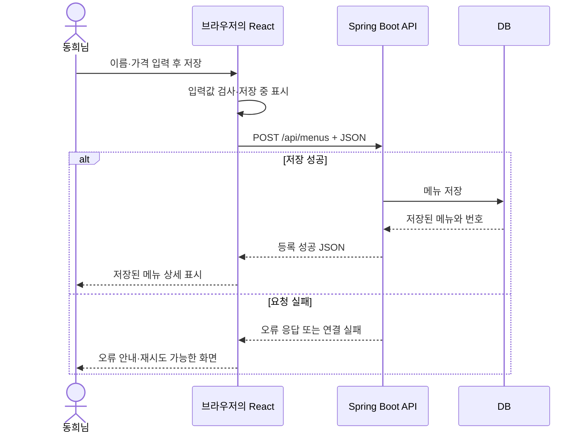
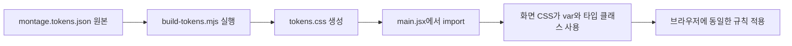

# 프론트엔드·React·디자인을 실제 메뉴 앱으로 읽기

확인 기준: 2026-09-30의 과제 코드와 공식 문서입니다. 아래 코드 예시는 실제 과제 파일에서 가져왔으며, 줄인 예시는 생략 여부를 표시합니다. 프론트엔드 기능은 구현되어 있지만 최종 시각 디자인은 Claude Design 결과를 기다리고 있습니다.

## FE-01. 먼저 전체에서 프론트엔드의 위치를 잡습니다

동희님이 사용하는 브라우저 안에서 메뉴 목록·입력창·버튼을 보여주고 사용자 행동을 처리하는 부분이 **프론트엔드**입니다. 우리 과제의 프론트엔드는 React로 만들었습니다. 데이터를 조회하고 저장하는 Java 프로그램은 Spring Boot **백엔드**, 그 데이터를 보관하는 프로그램은 **DB**입니다.

지금은 같은 컴퓨터 안에 있지만 역할과 실행 프로그램이 다릅니다. React 개발 화면은 `http://localhost:5175`, Spring Boot는 `http://localhost:8090`입니다. 5175와 8090은 두 프로그램이 요청을 받는 포트 번호입니다. React가 Java 코드를 직접 호출하거나 DB 파일을 직접 여는 구조가 아닙니다.



위 그림의 성공과 오류는 서로 다른 경로입니다. 연결 실패라면 서버의 오류 응답 자체가 없을 수도 있습니다. 프로그램의 파일들이 디스크에 존재하는 상태와 프로그램이 실행 중인 상태도 구분해야 합니다. `backend` 폴더가 있다고 서버가 켜져 있는 것은 아닙니다.

**읽기 실습:** [App.jsx](C:/Study-saltlux-ai-agent-service/90_Project/08_vibe-menu-assignment/frontend/src/App.jsx:7)에서 페이지 이름을 읽고, [client.js](C:/Study-saltlux-ai-agent-service/90_Project/08_vibe-menu-assignment/frontend/src/api/client.js:3)에서 서버 주소를 찾아보세요. 파일 이름을 외우기보다 “페이지를 선택하는 코드”와 “서버로 요청하는 코드”의 위치를 구분하는 것이 첫 목표입니다.

## FE-02. HTML·CSS·JavaScript는 각각 무엇을 합니까

| 이름 | 하는 일 | 메뉴 앱에서의 예 |
|---|---|---|
| HTML | 내용과 의미 있는 문서 구조를 나타냅니다 | 제목, 입력창, 저장 버튼, 메뉴 목록 |
| CSS | 표시 방식과 배치를 정합니다 | 버튼 색, 카드 간격, 테두리, 모바일 배치 |
| JavaScript | 값과 조건을 처리하고 사용자 행동에 반응합니다 | 이름 검사, 저장 요청, 응답 후 화면 이동 |

HTML의 `<button>`은 버튼이라는 요소입니다. CSS는 그 버튼의 배경색이나 안쪽 여백을 바꿀 수 있습니다. JavaScript는 클릭이나 폼 제출을 받았을 때 서버에 요청할 수 있습니다. HTML은 문서의 구조를 표현하는 마크업 언어이며, JavaScript와 같은 역할의 프로그래밍 언어는 아닙니다. [MDN HTML 소개](https://developer.mozilla.org/en-US/docs/Learn_web_development/Getting_started/Your_first_website/Creating_the_content)

React를 사용해도 최종적으로 브라우저에 HTML 요소가 생기고 CSS가 적용되며 JavaScript가 실행됩니다. React가 HTML·CSS·JavaScript를 없애는 것은 아닙니다. 대신 화면을 데이터와 연결해서 구성하는 방식을 제공합니다.

**오해하기 쉬운 점:** “화면이 보인다”와 “데이터가 저장된다”는 별개입니다. 실제 DB 없이 HTML로 만든 메뉴 카드 16개도 화면에는 보일 수 있습니다. 과제에서는 입력한 메뉴가 서버를 거쳐 DB에 저장되고 다시 조회되는 것까지 확인해야 합니다.

## FE-03. Java와 JavaScript, 객체와 JSON부터 구분합니다

Spring Boot 코드의 `.java`와 React 코드의 `.js`·`.jsx`는 서로 다른 언어입니다. 이름이 비슷하다고 JavaScript가 Java의 줄임말인 것은 아닙니다. 같은 `menuName`이라는 필드 이름을 사용하더라도 Java 객체와 JavaScript 객체가 한 메모리 안에서 공유되는 구조는 아닙니다.

JavaScript **객체**는 관련 값을 이름과 함께 묶은 값입니다. `form`은 객체를 담는 변수이고, `menuName`은 그 객체의 프로퍼티 이름입니다. 문자열 `'카페라떼'`가 실제 값입니다. 객체를 다른 변수에 대입하면 기본적으로 같은 객체를 가리키는 참조가 복사됩니다. `const`는 변수에 다른 값을 다시 대입하지 못하게 하며 객체 내용을 자동으로 불변으로 만들지는 않습니다. [MDN 객체](https://developer.mozilla.org/en-US/docs/Web/JavaScript/Guide/Working_with_objects)

```js
const form = {
    menuName: '카페라떼',
    menuPrice: '5000',
};

const price = Number(form.menuPrice);
```

이 학습용 예시에서 `form.menuPrice`는 문자열 `'5000'`, `price`는 숫자 `5000`입니다. 실제 과제의 필드 이름은 `price`가 아니라 **`menuPrice`**입니다. DOM 입력 요소의 `value`는 이 코드에서 문자열로 다루고, 서버 요청을 만들 때 `Number(...)`로 숫자로 바꿉니다.

**JSON**은 객체 모양의 데이터를 텍스트로 교환하는 형식입니다. 다음 JSON은 문자열을 큰따옴표로 쓰고, 함수나 Java 메서드를 담지 않습니다. Axios가 실제 요청 본문을 JSON으로 보내고 서버가 JSON을 읽는 것은 별도의 직렬화·역직렬화 과정입니다. 데이터 구조가 닮았다고 JavaScript 객체 자체가 인터넷으로 이동하는 것은 아닙니다.

```json
{
  "menuName": "카페라떼",
  "menuPrice": 5000,
  "categoryCode": 4,
  "orderableStatus": "Y"
}
```

여기서 카테고리 번호 4는 읽기 설명용 예시입니다. 실제 등록에서는 서버가 반환한 카테고리 목록에서 선택한 번호를 보내야 합니다. 없는 번호를 추측해 보내면 요청이 실패할 수 있습니다.

## FE-04. React와 컴포넌트

React는 사용자 인터페이스를 만드는 라이브러리입니다. **컴포넌트**는 화면의 일부와 그 부분의 동작을 묶은 단위입니다. 우리 코드에서는 JavaScript 함수가 JSX를 반환하는 방식으로 컴포넌트를 작성했습니다. 버튼처럼 작은 단위부터 페이지 전체까지 컴포넌트가 될 수 있습니다. [React 소개](https://react.dev/learn)

실제 [MenuFormPage.jsx](C:/Study-saltlux-ai-agent-service/90_Project/08_vibe-menu-assignment/frontend/src/pages/MenuFormPage.jsx:11)의 `MenuFormPage()`는 등록·수정 페이지를 구성하고, 같은 파일의 `MenuEditor()`는 입력 폼을 구성합니다. 부모 컴포넌트가 카테고리와 기존 메뉴를 준비한 뒤 자식에게 전달합니다.

```jsx
<MenuEditor
    menuCode={menuCode}
    initial={resource.data}
    categories={onlyChildren(categories.data)}
/>
```

위 코드는 실제 22~23줄에서 `key`를 생략하고 줄바꿈만 정리한 예시입니다. `<MenuEditor />`는 Java의 객체 생성 구문이 아닙니다. React가 이 컴포넌트를 화면 구성에 사용하라는 표현입니다. React는 렌더링 과정에서 함수를 실행하고 반환된 UI 설명을 바탕으로 브라우저의 화면을 갱신합니다.

## FE-05. JSX와 렌더링

**JSX**는 JavaScript 코드 안에서 UI를 HTML과 비슷한 모양으로 적는 문법입니다. `.jsx` 파일은 Vite의 변환 과정을 거칩니다. HTML 문서와 완전히 같은 문법은 아니므로 `className`, 닫힌 태그, 자바스크립트 표현식의 `{}`를 읽을 수 있어야 합니다. [React JSX 문법](https://react.dev/learn/writing-markup-with-jsx)

```jsx
<h1 className="title1 bold">
    {menuCode ? '메뉴 수정' : '메뉴 등록'}
</h1>
```

실제 코드의 `menuCode`가 있으면 문자열 `'메뉴 수정'`, 없으면 `'메뉴 등록'`을 선택합니다. `{}` 안의 내용은 JavaScript 표현식이고, 선택한 값이 제목에 들어갑니다. `'title1 bold'`는 CSS 클래스 두 개를 적용합니다. 컴포넌트 안의 일반 변수를 `{}`로 표시한다고 자동 저장 기능이 붙는 것은 아닙니다.

**렌더링**은 현재 데이터로 UI를 계산하는 과정입니다. React는 state가 바뀌면 컴포넌트를 다시 실행해 다음 UI를 계산합니다. “다시 렌더링한다”는 말이 “매번 전체 페이지를 새로고침한다”는 뜻은 아닙니다. 현재 렌더에서 읽는 state 값은 그 렌더의 값입니다. [React state 스냅샷](https://react.dev/learn/state-as-a-snapshot)

**읽기 실습:** 제목 JSX에서 `?`의 앞·뒤 값을 하나씩 읽어 보세요. `menuCode`는 메뉴 이름이 아니라 URL에서 받은 메뉴 번호라는 점까지 연결하면 됩니다.

## FE-06. props와 state

**props**는 부모가 자식 컴포넌트에 전달하는 입력입니다. `initial={resource.data}`에서 `initial`은 전달하는 이름이고 `resource.data`는 전달되는 값입니다. 자식의 `function MenuEditor({ menuCode, initial, categories })`는 props 객체에서 그 세 프로퍼티를 꺼내는 구조 분해 문법입니다. props를 받은 자식이 부모 데이터를 직접 변경하는 방식은 피합니다. [React props](https://react.dev/learn/passing-props-to-a-component)

**state**는 컴포넌트가 렌더 사이에 기억하고, 변경 시 화면 갱신에 사용하는 상태입니다. 현재 입력값 `form`, 필드별 오류 `errors`, 서버 오류 `error`, 저장 중 여부 `busy`가 state입니다. [React useState](https://react.dev/reference/react/useState)

```js
const [busy, setBusy] = useState(false);
```

이 실제 코드는 `useState(false)`를 호출하고 반환된 배열의 첫 번째 값을 `busy`, 두 번째 값인 갱신 함수를 `setBusy`에 받습니다. `false`는 초기값입니다. `setBusy(true)`는 다음 렌더에서 `busy`가 `true`가 되도록 요청합니다. `setBusy`의 반환값에 새 상태가 담기는 구조는 아닙니다.

```jsx
<button disabled={busy} type="submit">
    {busy ? '저장 중…' : '저장'}
</button>
```

실제 82줄을 줄바꿈한 이 코드는 저장 중 버튼을 비활성화하고 문구를 바꿉니다. **React state와 DB 데이터는 다른 저장소**입니다. 페이지를 새로고침하면 이 컴포넌트의 상태가 다시 시작될 수 있지만, 서버 DB에 저장한 메뉴까지 지워지는 것은 아닙니다.

## FE-07. 이벤트와 제어 입력창

**이벤트**는 입력 변경, 클릭, 폼 제출 같은 사용자의 행동을 브라우저가 알리는 것입니다. **이벤트 핸들러**는 그때 실행할 함수입니다. `onChange={change}`는 함수 참조를 전달합니다. `onChange={change()}`처럼 작성하면 클릭 때 호출하라는 뜻과 달라집니다. [React 이벤트](https://react.dev/learn/responding-to-events)

```jsx
<input
    name="menuName"
    value={form.menuName}
    onChange={change}
/>
```

위 코드는 실제 입력창에서 검증 속성만 생략한 것입니다. **제어 입력창**은 표시할 값을 React state에서 정하고 변경 이벤트로 state를 갱신하는 입력창입니다. `value`만 고정하고 `onChange`에서 새 값을 저장하지 않으면 정상 입력이 어려워집니다. [React input](https://react.dev/reference/react-dom/components/input)

```js
function change(event) {
    setForm({ ...form, [event.target.name]: event.target.value });
}
```

실제 `change` 함수에 이름 입력 이벤트가 들어왔다고 생각해 보세요. `event.target.name`은 `'menuName'`, `event.target.value`는 입력한 문자열입니다. `...form`은 기존 프로퍼티를 얕게 복사하고, `[event.target.name]`은 그 문자열을 프로퍼티 이름으로 사용하여 새 값을 넣습니다. `form.menuName = ...`처럼 기존 state 객체를 직접 고치는 코드가 아닙니다.

한 이벤트를 여러 필드에 재사용하려고 계산된 프로퍼티 이름을 썼습니다. 먼저 다음 학습용 근사 코드를 이해한 뒤 실제 한 줄을 읽어도 됩니다. 근사 코드는 이름 필드에만 대응하므로 실제 코드 전체와 동일한 변환은 아닙니다.

```js
const nextForm = {
    menuName: event.target.value,
    menuPrice: form.menuPrice,
    categoryCode: form.categoryCode,
    orderableStatus: form.orderableStatus,
};
setForm(nextForm);
```

## FE-08. 저장 버튼에서 API 요청까지 실제 값 하나를 추적합니다

동희님이 이름 `'카페라떼'`, 가격 문자열 `'5000'`을 입력하고 실제 목록에 있는 카테고리를 선택했다고 가정하겠습니다. 이것은 코드를 읽는 예시이며 신규 실험 메뉴를 등록할 필요는 없습니다.

실제 [submit 함수](C:/Study-saltlux-ai-agent-service/90_Project/08_vibe-menu-assignment/frontend/src/pages/MenuFormPage.jsx:41)는 다음 순서로 일합니다.

1. `event.preventDefault()`로 HTML 폼의 기본 제출 동작을 막습니다. 이 코드의 API 요청 자체를 막는 것은 아닙니다.
2. `busy`와 입력값을 검사합니다. 이름, 정수 가격, 실제 카테고리가 적절하지 않으면 오류를 보여주고 여기서 끝납니다.
3. `setBusy(true)`로 저장 중 상태를 준비합니다.
4. `payload`라는 새 객체에 서버가 기대하는 필드와 타입을 담습니다.
5. 등록이면 `createMenu(payload)`, 수정이면 `updateMenu(menuCode, payload)`를 호출합니다.
6. 성공한 메뉴 객체를 `saved`에 받고 `saved.menuCode`로 상세 URL을 만듭니다.
7. 실패하면 `catch`에서 오류를 보여주며, `finally`에서 저장 중 상태를 해제합니다.

```js
const payload = {
    menuName: form.menuName.trim(),
    menuPrice: Number(form.menuPrice),
    categoryCode: Number(form.categoryCode),
    orderableStatus: form.orderableStatus,
};
```

실제 54~55줄을 줄바꿈한 코드입니다. `trim()`은 이름 양끝 공백을 제거합니다. `'5000'`은 `5000`으로 변환됩니다. `payload`를 만들었다고 서버 저장이 끝난 것은 아닙니다. 다음 함수 호출이 실제 요청을 시작합니다.

실제 [createMenu](C:/Study-saltlux-ai-agent-service/90_Project/08_vibe-menu-assignment/frontend/src/api/menu.js:41)는 다음 구조입니다.

```js
export async function createMenu({ menuName, menuPrice, categoryCode, orderableStatus }) {
    const result = await postResult('/api/menus', {
        menuName,
        menuPrice,
        categoryCode,
        orderableStatus,
    });
    return result.menu;
}
```

매개변수의 `{...}`는 전달된 `payload` 객체를 분해하는 문법입니다. 요청 객체 안의 `menuName,`은 `menuName: menuName,`의 축약입니다. `return result.menu`는 서버에서 받은 결과 중 메뉴 객체를 반환합니다. 등록할 때 `menuCode`는 보내지 않으며 서버가 채웁니다.

실제 [postResult](C:/Study-saltlux-ai-agent-service/90_Project/08_vibe-menu-assignment/frontend/src/api/client.js:10)는 `api.post(url, body)`를 호출합니다. 기본 서버 주소는 `http://localhost:8090`이므로 경로 `/api/menus`와 합쳐져 그 서버로 요청합니다. 응답의 `data.result`를 꺼내 `createMenu`로 돌려줍니다. 여기의 `.data.result`는 이번 서버의 응답 모양에 맞춘 코드입니다. 모든 API에 `result`가 있다는 규칙은 없습니다.

마지막 [navigate](C:/Study-saltlux-ai-agent-service/90_Project/08_vibe-menu-assignment/frontend/src/pages/MenuFormPage.jsx:57)는 `'/menus/' + saved.menuCode`라는 React 상세 화면 주소로 이동합니다. 상세 화면은 그 번호를 사용해 다시 서버에서 메뉴를 조회합니다. 정상 응답을 받기 전에 임의로 “저장 완료”를 표시하는 구조가 아닙니다.

## FE-09. 비동기·Promise·async/await

**비동기 작업**은 네트워크 응답처럼 즉시 끝나지 않는 작업의 결과를 나중에 처리하는 것입니다. 요청하는 동안 브라우저가 화면 표시나 다른 이벤트 처리를 계속할 수 있게 해야 합니다.

**Promise**는 나중에 성공 값 또는 실패 이유가 정해질 작업을 나타내는 객체입니다. 상태는 대기, 이행, 거부로 설명할 수 있습니다. “Promise를 반환했다”가 “메뉴 데이터를 지금 반환했다”와 같지는 않습니다. [MDN Promise](https://developer.mozilla.org/en-US/docs/Web/JavaScript/Reference/Global_Objects/Promise)

`async function`은 Promise를 반환합니다. `await`는 그 비동기 함수의 이어지는 처리를 해당 Promise의 결과가 정해질 때까지 기다리게 합니다. 브라우저 전체를 얼리는 명령이 아닙니다. 성공하면 값을 받아 계속 진행하고, 실패하면 오류가 던져져 `catch`로 처리할 수 있습니다. [MDN async function](https://developer.mozilla.org/en-US/docs/Web/JavaScript/Reference/Statements/async_function)

```js
const saved = await createMenu(payload);
navigate('/menus/' + saved.menuCode);
```

위 학습용 두 줄은 실제 등록 분기의 핵심만 뽑은 것입니다. `await`가 없으면 `saved`에 메뉴 객체 대신 Promise를 받게 되어 `saved.menuCode`를 바로 사용할 수 없습니다. `async`를 붙였다고 자동으로 HTTP 요청이나 병렬 작업이 생성되는 것은 아닙니다. 실제 요청을 하는 것은 여기서 호출한 Axios입니다.

## FE-10. fetch와 Axios, 오류를 다루는 이유

`fetch()`는 브라우저에서 HTTP 요청을 보낼 때 사용하는 Web API입니다. Axios는 HTTP 요청을 편하게 작성하는 별도 라이브러리이고, 이번 과제에서 선택한 요청 도구입니다. 둘 다 요청을 보내는 수단이며 별개의 백엔드나 DB가 아닙니다. [MDN fetch](https://developer.mozilla.org/en-US/docs/Web/API/Fetch_API/Using_Fetch), [Axios 공식 소개](https://axios-http.com/docs/intro)

기본적인 차이 하나만 알아두셔도 좋습니다. `fetch()`는 HTTP 404나 500 응답을 받았다고 항상 Promise를 거부하지 않으므로 응답의 `ok` 등을 검사해야 합니다. Axios는 기본 성공 상태 판정에서 벗어난 응답을 오류 경로로 처리하며, 이 판정은 설정할 수 있습니다. 두 도구를 섞어 비교할 때 오류 처리 방식도 확인해야 합니다.

실제 [client.js](C:/Study-saltlux-ai-agent-service/90_Project/08_vibe-menu-assignment/frontend/src/api/client.js:19)는 서버가 보낸 오류 설명이 있으면 표시하고, 응답이 아예 없으면 연결 실패 안내를 만듭니다. 사용자는 요청이 실패한 것과 검색 결과가 없는 것을 구분할 수 있어야 합니다. 요청 중 상태, 오류, 재시도, 빈 목록은 서로 다른 UI 상태입니다.

우리 프로젝트 규칙은 HTTP 요청을 `src/api/*.js`에 모으는 것입니다. 페이지가 필요한 함수를 호출하면 API 파일이 주소와 응답 구조를 처리합니다. 주소가 바뀌었을 때 화면마다 Axios 코드를 찾아 수정하지 않도록 책임을 나눕니다. 이것은 이번 프로젝트의 규칙이며 React 자체가 강제하는 파일 구조는 아닙니다.

## FE-11. Hook·useEffect·요청 취소는 보충 단계입니다

**Hook**은 React의 상태나 외부 시스템 연동 같은 기능을 컴포넌트에서 사용하는 함수입니다. `useState`, `useEffect`가 내장 Hook이고 `useResource`는 이 과제에서 만든 커스텀 Hook입니다. Hook은 조건문이나 반복문 안에 임의로 호출하지 않고 컴포넌트 또는 다른 Hook의 최상위에서 호출합니다. [React useState](https://react.dev/reference/react/useState)

**useEffect**는 렌더링 후 외부 시스템과 동기화하는 데 사용하는 Hook입니다. 이번 `useResource`는 화면 URL에 해당하는 데이터를 서버에서 읽는 일을 맡깁니다. effect의 의존성이 달라지면 필요한 동기화를 다시 하고, 정리 함수를 통해 이전 일을 정리합니다. 모든 계산이나 저장 버튼 동작을 무조건 effect에 넣어야 하는 것은 아닙니다. 사용자 저장 요청은 앞서 본 `submit` 이벤트에서 시작합니다. [React useEffect](https://react.dev/reference/react/useEffect), [React effect의 역할](https://react.dev/learn/synchronizing-with-effects)

실제 [useResource.js](C:/Study-saltlux-ai-agent-service/90_Project/08_vibe-menu-assignment/frontend/src/hooks/useResource.js:9)는 `AbortController`를 만들고, 그 `signal`을 API 함수에 전달합니다. 다른 검색 요청으로 바뀌거나 화면이 사라지면 이전 요청을 중단하고, 중단된 응답은 state에 반영하지 않습니다. 늦게 도착한 이전 검색 결과가 현재 화면을 덮는 상황을 줄이기 위한 처리입니다. Axios도 `signal`을 통한 취소를 지원합니다. [Axios 요청 취소](https://axios-http.com/docs/cancellation)

이 파일의 `requestKey`, `attempt`, Promise 연결 방식은 구현 보충입니다. 초보 학습의 선행 목표로 전부 외울 필요는 없습니다. 먼저 “상태를 기억한다 → 요청한다 → 성공/실패를 표시한다 → 필요 없어진 요청을 정리한다”를 이해하면 됩니다. 취소한다고 이미 서버에 저장된 데이터를 자동으로 되돌리는 것은 아닙니다.

## FE-12. React의 페이지 주소와 서버 API 주소

**라우팅**은 주소를 보고 어떤 화면 또는 처리로 연결할지 정하는 것입니다. 같은 `/menus`라는 문자열이 보이더라도 어느 프로그램의 주소인지 확인해야 합니다. React Router의 `BrowserRouter`는 브라우저 주소와 History API를 사용해 클라이언트 화면 이동을 관리합니다. [React Router BrowserRouter](https://reactrouter.com/api/declarative-routers/BrowserRouter)

| 주소 예 | 담당 | 결과 |
|---|---|---|
| `http://localhost:5175/menus/1` | React 라우터 | 1번 메뉴의 상세 화면을 표시합니다 |
| `http://localhost:5175/menus/new` | React 라우터 | 등록 화면을 표시합니다 |
| `http://localhost:8090/api/menus/1` | Spring Boot API | 1번 메뉴 데이터 JSON을 반환합니다 |

실제 [App.jsx](C:/Study-saltlux-ai-agent-service/90_Project/08_vibe-menu-assignment/frontend/src/App.jsx:9)의 `path="/menus/:menuCode"`에서 `:menuCode`는 바뀌는 번호 자리입니다. `/menus/1`로 이동하면 `useParams()`가 읽는 `menuCode` 값은 문자열 `'1'`입니다. `Link`나 `navigate`는 앱 화면 이동에 사용하고 Axios는 서버 데이터 요청에 사용합니다. [React Router 경로](https://reactrouter.com/start/declarative/routing)

개발 서버에서는 상세 화면 새로고침이 되지만, 나중에 배포하는 서버도 화면 경로로 들어오면 React 진입 HTML을 제공하도록 설정해야 합니다. 브라우저 라우팅을 등록했다고 Spring Boot에 같은 API가 자동 생성되는 것은 아닙니다.

## FE-13. 검색 조건·페이지를 URL에 넣는 이유

목록에서 검색어를 입력하면 `/?q=라떼&page=1`처럼 조건을 주소에 담습니다. 검색어 `q`, 카테고리 `category`, 기준 가격 `price`, 페이지 `page`를 사용합니다. 주소에서 조건을 복원하므로 새로고침 후에도 동일한 검색 조건을 사용할 수 있습니다.

실제 [MenuListPage.jsx](C:/Study-saltlux-ai-agent-service/90_Project/08_vibe-menu-assignment/frontend/src/pages/MenuListPage.jsx:15)에서 `params.get('q')`는 검색어를 읽습니다. 검색 버튼은 34줄의 `filter`를 호출하고 조건을 바꿀 때 페이지를 1로 초기화합니다. 45줄의 `movePage`는 검색 조건을 유지하며 페이지 번호만 바꿉니다.

**현재 구현의 정확한 처리:** 아무 필터가 없으면 서버 페이징 API를 호출합니다. 이름·카테고리 필터는 전체 메뉴 데이터를 받은 뒤 브라우저에서 거릅니다. 가격이 있으면 서버의 “입력 가격 초과” API 결과를 받고 이름·카테고리를 추가로 거릅니다. 필터링 결과는 브라우저에서 12개씩 잘라 표시합니다. 이는 수업 API에 이름 검색·카테고리 검색 계약이 없기 때문이며 대규모 데이터 검색을 모두 브라우저에서 처리하는 방식을 권장한다는 뜻은 아닙니다.

**경계:** 기준 가격 5,000이면 정확히 5,000원인 메뉴는 제외됩니다. **초과(`>`)**이며 이상(`>=`)이 아닙니다. 페이지 요청은 이번 API에서 **1부터** 보냅니다. 다른 API의 0부터 세는 규칙과 혼용하지 않습니다. 서버가 돌려주는 `number` 필드를 모든 표시 번호와 무조건 같은 뜻으로 가정할 필요도 없습니다. 현재 목록의 페이지 표시는 URL의 `page` 값입니다.

메뉴 배열을 화면에 표시할 때 `map()`으로 각 항목의 JSX를 만들며, `key={menu.menuCode}`를 지정합니다. `key`는 형제 항목 사이에서 어떤 항목인지 구분하는 데 사용하는 식별자이며 브라우저에 보이는 메뉴 번호 라벨과는 다른 목적입니다. [React 목록 렌더링](https://react.dev/learn/rendering-lists)

**안전한 읽기 실습:** 목록에서 검색하고 새로고침한 뒤 주소와 입력값이 유지되는지 봅니다. 서버 API URL에는 `q`가 자동 추가된다고 추측하지 말고 21~30줄을 읽어 어떤 API 함수를 호출하는지 확인합니다.

## FE-14. Node.js·npm·Vite는 React의 무엇입니까

**Node.js**는 브라우저 밖에서 JavaScript를 실행하는 환경입니다. 이번 프로젝트에서는 Vite 개발 서버와 토큰 생성 스크립트 등을 실행합니다. React 화면의 사용자 이벤트는 브라우저에서 실행되고, 메뉴 저장 업무는 Spring Boot에서 처리합니다. Node를 설치했다고 별도의 메뉴 저장 서버가 자동으로 생기는 것은 아닙니다. [Node.js 공식 소개](https://nodejs.org/en/learn/getting-started/introduction-to-nodejs)

**npm**은 패키지를 설치하고 프로젝트에 등록된 명령을 실행하는 도구입니다. `npm run dev`의 `dev`는 운영체제 명령 이름이 아니라 `package.json`의 `scripts`에 정의된 이름입니다. 우리 `dev`에는 `npm run tokens && vite`가 적혀 있으므로 토큰 CSS를 만든 다음 Vite를 실행합니다. [npm package.json](https://docs.npmjs.com/cli/v11/configuring-npm/package-json)

**Vite**는 개발 중 파일을 변환하고 개발 서버를 제공하며 배포용 파일을 빌드하는 도구입니다. `.jsx`와 모듈 import를 개발·빌드 흐름에서 처리합니다. Vite 개발 서버는 Java API 서버와 역할이 다릅니다. [Vite 소개](https://vite.dev/guide/)

| 파일·폴더·명령 | 이번 과제에서의 뜻 |
|---|---|
| `package.json` | 프로젝트 이름, 의존성 요구 범위, 실행 명령 |
| `package-lock.json` | 실제 해결된 의존성 버전·구조를 기록해 설치 재현을 돕는 파일 |
| `node_modules/` | 설치된 패키지 파일들; 소스 파일처럼 직접 수정하지 않습니다 |
| `npm run dev` | 개발 화면을 제공하는 Vite 실행; 이번 포트는 5175 |
| `npm run lint` | 정해진 정적 코드 규칙 검사; 실제 서버 동작의 증명은 아닙니다 |
| `npm run build` | 배포에 사용할 HTML·JavaScript·CSS 묶음 생성 |
| `dist/` | Vite 빌드 결과의 기본 폴더; 서버 DB나 Java 실행 파일이 아닙니다 |

lock 파일은 `package.json`과 함께 관리하며, 설치된 정확한 버전을 요구 범위와 구분합니다. 현재 `package.json`의 React 요구 범위는 `^19.2.8`입니다. 공식 문서의 최신 표시가 바뀌어도 그것을 로컬 설치 버전으로 보고하면 안 됩니다. [npm package-lock.json](https://docs.npmjs.com/cli/v11/configuring-npm/package-lock-json)

Vite build 결과를 배포해도 Spring Boot·DB가 실행되거나 배포되는 것은 아닙니다. React에서 요청하는 서버 주소, 서버의 접근 허용, 페이지 진입 처리 등 배포 환경에 맞춘 연결 작업은 별도입니다. 현재는 로컬 과제이며 GitHub URL 준비와 제출이 남아 있습니다. [Vite production build](https://vite.dev/guide/build)

## FE-15. CSS Module과 공통 컴포넌트

**CSS Module**은 컴포넌트에서 가져다 쓰는 CSS 클래스 이름을 모듈 단위로 다루는 방법입니다. Vite는 `.module.css` 이름의 파일을 CSS Module로 처리합니다. `import styles from './Scaffold.module.css'` 후 `className={styles.panel}`로 클래스명을 사용합니다. 서로 다른 파일에서 같은 클래스명 `panel`을 썼을 때 이름 충돌을 줄이는 데 도움이 됩니다. [Vite CSS Modules](https://vite.dev/guide/features#css-modules)

반면 `tokens.css`의 `.title1`, `.body1` 같은 공통 타입 클래스는 전역으로 가져오며 `className="title1 bold"`처럼 사용합니다. CSS Module을 쓴다고 모든 CSS가 자동으로 디자인 시스템을 따르는 것은 아닙니다.

**공통 컴포넌트**는 같은 구조·행동을 재사용하기 위한 화면 코드입니다. 우리 앱의 `Layout`은 공통 레이아웃, `Feedback`은 대기·오류 안내, `DeleteDialog`는 삭제 확인 동작입니다. 공통 코드와 디자인 토큰을 함께 사용해야 화면마다 버튼 모양과 상태 표현이 제각각인 상황을 줄일 수 있습니다. 공통 컴포넌트가 반드시 npm에 배포한 라이브러리일 필요는 없습니다.

## FE-16. 디자인 시스템·토큰·semantic 값

**디자인 시스템**은 색·타입·간격 같은 시각 규칙, 버튼·입력창 같은 공통 요소, 상태·접근성·사용 지침 등을 함께 정리한 기준입니다. **디자인 토큰**은 그중 여러 도구와 코드에서 일관되게 사용할 디자인 결정을 이름 있는 값으로 표현한 것입니다. 색상 표만 확보했다고 완성된 디자인 시스템 전체를 구현한 것은 아닙니다. 토큰 데이터 교환을 위한 DTCG 규격도 있습니다. [Design Tokens Community Group 형식 규격](https://www.designtokens.org/TR/2025.10/format/)

이번 과제는 공개 Montage 디자인 소스에서 추출한 JSON을 사용합니다. 파일이 JSON이라고 DTCG의 모든 규칙을 만족한다는 뜻은 아닙니다. 우리 토큰 파일에는 프로젝트의 추출 구조와 `$meta` 출처가 있으며, 그 구조를 이해하는 전용 생성 스크립트가 있습니다.

**atomic/원시 토큰**은 팔레트의 특정 색이나 수치 같은 기초값이고, **semantic/의미 토큰**은 “기본 본문 글자”, “주요 행동”, “오류”처럼 용도를 이름으로 나타내는 값입니다. 예를 들어 UI에서 파란색 번호를 직접 고르는 대신 `--primary-normal`이라는 역할을 사용하면 테마가 바뀔 때 역할을 유지하며 다른 색으로 대응할 수 있습니다. 이 설명은 이번 Montage 토큰 구조를 해석한 것입니다.

실제 [tokens.css](C:/Study-saltlux-ai-agent-service/90_Project/08_vibe-menu-assignment/frontend/src/tokens.css:7)의 라이트 테마는 `--primary-normal: #0066FF`, 137줄의 다크 테마는 같은 이름에 `#3385FF`를 둡니다. 화면 코드에서는 `background: var(--primary-normal)`처럼 읽습니다. CSS custom property는 `--` 이름으로 선언하고 `var()`로 사용하는 CSS 기능입니다. [MDN CSS 변수](https://developer.mozilla.org/en-US/docs/Web/CSS/Using_CSS_custom_properties)

토큰이 제공되어 있다고 앱에 테마 전환 버튼이 이미 만들어진 것은 아닙니다. 현재 생성 CSS에는 `[data-theme="dark"]` 대응이 있고, Claude에게 다크 대응을 요청했습니다. 최종 테마 UX는 디자인 결과를 적용할 때 정해야 합니다.

## FE-17. JSON에서 화면 색까지, 생성 파일을 직접 고치지 않는 이유

이번 과제의 기준 원본은 [montage.tokens.json](C:/Study-saltlux-ai-agent-service/90_Project/08_vibe-menu-assignment/frontend/design/montage.tokens.json)입니다. 생성된 CSS는 [tokens.css](C:/Study-saltlux-ai-agent-service/90_Project/08_vibe-menu-assignment/frontend/src/tokens.css)입니다. `design-handoff` 안의 두 파일은 Claude 전달용 사본입니다.



실제 [build-tokens.mjs](C:/Study-saltlux-ai-agent-service/90_Project/08_vibe-menu-assignment/frontend/scripts/build-tokens.mjs:17)는 JSON을 읽고 semantic 색·그림자, 간격·z-index·radius·opacity, 타입 클래스를 CSS로 출력합니다. JSON 이름 `primary.normal`을 CSS의 `--primary-normal` 같은 이름으로 바꾸며, light/dark 값을 각각 기본 `:root`와 `[data-theme="dark"]`에 적습니다.

```css
/* 실제 공통 카드 스타일의 일부 */
.panel {
    padding: var(--space-24);
    border-radius: var(--radius-12);
}
```

이는 실제 [Scaffold.module.css](C:/Study-saltlux-ai-agent-service/90_Project/08_vibe-menu-assignment/frontend/src/components/Scaffold.module.css:15)에서 테두리 속성만 생략한 코드입니다. 토큰 변수는 각각 24px, 12px에 대응합니다. `tokens.css`를 직접 바꾸면 다음 생성 시 그 변경이 덮일 수 있습니다. 토큰 변경은 원본 JSON에서 하고 생성 명령을 다시 실행하는 것이 이 프로젝트의 규칙입니다. 다만 학습 중 값의 의미를 읽는 것과 실제 토큰을 수정하는 것은 다른 작업입니다.

타입 스타일은 글자 크기만이 아니라 행간·자간·굵기를 함께 정합니다. `.title1.bold`가 있으므로 제목마다 임의의 `font-size`를 추가하는 방식 대신 기준 스타일을 대응시킵니다. 색·간격·모서리·타입을 한 기준에서 읽어 여러 페이지의 디자인을 맞추는 것이 과제의 핵심 중 하나입니다.

## FE-18. radius 값을 추출했다는 말의 정확한 뜻

**radius**는 모서리의 둥근 정도입니다. 원래 재사용한 샘플 토큰 JSON에는 radius 항목이 빠져 있었습니다. 과제 수업 자료는 실제 컴포넌트 스타일에서 radius를 찾도록 안내하므로, Codex가 Montage 원본 컴포넌트의 `style.ts`를 읽어 상수 값을 보충했습니다.

예를 들어 실제 원본 [button/style.ts](C:/Study-saltlux-ai-agent-service/06_fronted/original-materials/99_vibe_design/vibe-design-test/montage-web-main/packages/wds/src/components/button/style.ts:73)에 `border-radius: 12px;`가 있습니다. 12라는 값을 보기 좋을 것 같아서 임의로 만든 것이 아닙니다.

[augment-radius.mjs](C:/Study-saltlux-ai-agent-service/90_Project/08_vibe-menu-assignment/scripts/augment-radius.mjs:15)는 컴포넌트 `style.ts`를 읽고 상수인 단일 `border-radius`와 코너 radius 값을 추출합니다. 동적 표현식·`inherit`는 제외합니다. 16종의 상수를 수집했으며 JSON의 각 `sources`에 원본 파일·줄 번호를 기록했습니다.

출처에 있는 값을 모은 작업과 “이 카드에 어느 radius를 쓰는 것이 좋은가”라는 디자인 결정은 별개입니다. 큰 pill 모서리와 작은 입력창 모서리를 같은 곳에 무조건 적용하는 것이 아닙니다. Claude에게 실제 토큰 중 용도에 맞는 값을 선택하고 정확한 이름을 인계하도록 요청한 이유입니다. 추출 스크립트가 모든 동적 디자인 규칙을 완전히 복원했다는 뜻도 아닙니다.

## FE-19. 시안·프로토타입·React 구현·연동의 차이

| 결과물 | 확인하는 것 | 그것만으로 증명되지 않는 것 |
|---|---|---|
| 화면 시안 | 배치·색·글자·컴포넌트 규칙 | 실제 저장·조회 |
| 클릭 가능한 프로토타입 | 화면 전환과 상태의 의도 | 실제 API·DB 동작 |
| React 기능 구현 | 입력·검증·버튼·경로·상태 처리 | 최종 디자인의 만족도 |
| 서버 연동 | 실제 API 요청과 응답 처리 | 모든 실패·모바일 상태의 완성도 |
| DB 저장·재조회 | 데이터가 실제로 저장되어 다시 보임 | 공개 배포·과제 제출 완료 |

**Claude Design에게 전달할 요청:** 준비된 API 기능과 토큰으로 공통 컴포넌트, 목록, 상세, 등록·수정 공용 폼, 대기·오류·빈 상태를 디자인합니다. 한국어 UI, 데스크톱·모바일, 정확한 토큰 이름과 구현 인계 자료를 요청합니다. API에 없는 사진·별점·주문·결제를 가정하지 않습니다.

**실제 전달 상태:** Codex가 [Claude용 프롬프트](C:/Study-saltlux-ai-agent-service/90_Project/08_vibe-menu-assignment/design-handoff/claude-design-prompt.md:8)와 네 참고 파일을 준비했습니다. Codex가 Claude에게 직접 요청을 보낸 기록이나 디자인 결과를 받은 기록은 없습니다. 사용자께서 Claude Design에 전달하는 단계입니다. 로컬 경로를 적는 것만으로 모든 Claude 환경에서 파일 접근이 되는 것은 아니므로 접근을 지원하지 않는 환경에서는 파일 내용을 첨부합니다.

**Codex가 구현한 프론트 작업:** Vite React 프로젝트, 화면 경로, 목록·검색·상세·등록·수정·삭제, API 클라이언트, 오류·대기·취소 처리, 토큰 생성과 검사, 기능 확인용 스타일을 준비했습니다. 기존 참고 예제의 API 어댑터·토큰 생성 코드를 재사용한 부분과 새로 작성한 부분은 [sources.md](C:/Study-saltlux-ai-agent-service/90_Project/08_vibe-menu-assignment/docs/sources.md)에 구분했습니다.

**남은 작업:** 디자인 시안 확인·조정 → 디자인을 React JSX/CSS Module과 공통 컴포넌트에 적용 → 기능·접근성·모바일 상태 재검사 → Spring Boot와 React를 함께 포함한 제출 저장소 정리 → 개인별 GitHub URL 제출입니다. 디자인 시안만 받거나 코드만 GitHub에 올린 상태를 과제 전체 완료로 기록하지 않습니다.

## FE-20. 이번 프로젝트의 제약과 공부 순서

실제 런타임 의존성은 **react, react-dom, react-router, axios**입니다. UI 라이브러리나 CSS 프레임워크를 쓰지 않고 JavaScript/JSX와 CSS Module을 사용합니다. `devDependencies`에 타입 선언 패키지가 있어도 앱 자체를 TypeScript로 작성했다는 뜻은 아닙니다. 이 기준은 첨부 수업과 프로젝트 지침의 선택이며 실무의 모든 React 앱에 적용되는 보편적인 제한은 아닙니다.

현재 lint/build와 실제 API·브라우저 CRUD를 통과했다는 작업 기록은 [verification.md](C:/Study-saltlux-ai-agent-service/90_Project/08_vibe-menu-assignment/docs/verification.md)에 있습니다. 이 원고를 작성하는 과정에서 기능 검사를 새로 실행한 것은 아닙니다. 기존 검증의 범위는 H2 실행, 기능 확인 화면이며 최종 Claude 디자인 적용이나 MySQL 연결 검증까지 포함하지 않습니다.

권장 읽기 순서는 FE-01의 전체 흐름 → FE-03의 객체와 값 → FE-04~07의 컴포넌트·입력 → FE-08의 저장 추적 → FE-09~12의 통신·라우팅 → FE-14~18의 개발 도구·디자인입니다. 첫날 `useResource`의 Promise 연결이나 모든 토큰 이름을 외울 필요는 없습니다.

첫 읽기 목표는 다음 세 문장을 실제 코드 위치와 함께 설명할 수 있는 것입니다.

1. “입력한 이름은 `form.menuName`에 있고, 저장할 때 `payload.menuName`으로 넣습니다.”
2. “`createMenu`는 API 요청 함수를 통해 Spring Boot에 데이터를 보냅니다.”
3. “서버가 반환한 메뉴 번호를 받아 상세 화면으로 이동하고, 화면 스타일은 토큰을 사용합니다.”

공부를 위해 기존 메뉴를 임의 삭제하거나 DB를 비울 필요는 없습니다. 파일을 읽고 값을 종이에 추적하거나 이름 검색·페이지 이동처럼 데이터가 바뀌지 않는 행동부터 확인할 수 있습니다.
